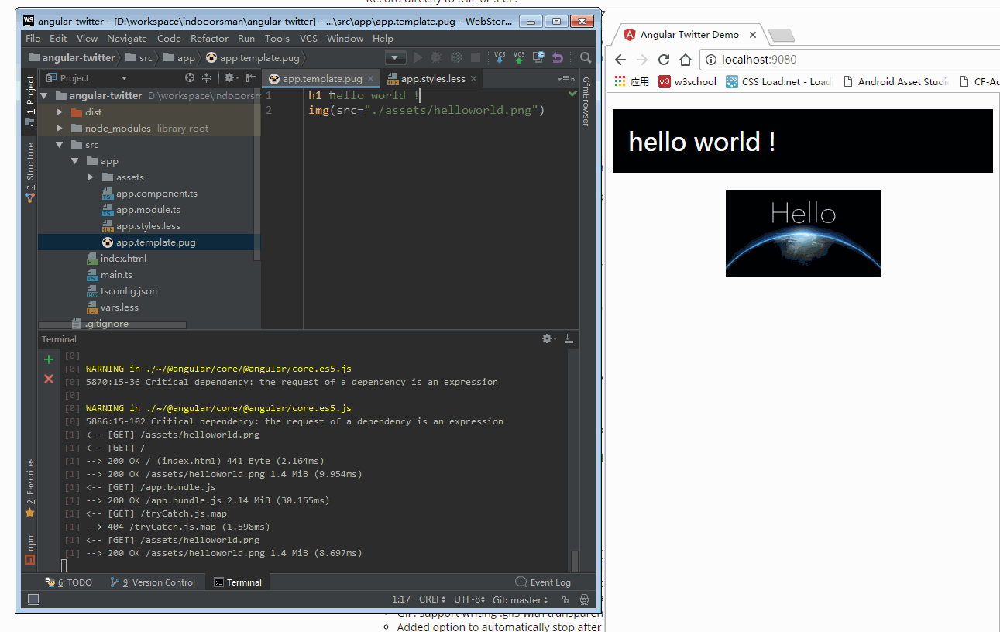

<h1>Angular从零开始 - 02.live reloading & webpack dev server<sub>2017-04-28</sub></h1>

> 接上篇[Angular 2从零开始 - 01.模板引擎和样式预处理器](Angular-2E4BB8EE99BB6E5BC80E5A78B---01)。Angular目前已经升级到4.x，之后的教程中统一使用`Angular`，而不是`Angular2`。如果你之前已经下载过[示例源码](https://github.com/indooorsman/angular-twitter)，请更新代码，并重新执行`npm install`，这会将`Angular`升级到4.x

要实现修改代码后自动重新编译并自动刷新页面，有两种方案：

1. [webpack watch mode](https://webpack.js.org/guides/development/#webpack-watch-mode) + [live reload plugin](https://github.com/statianzo/webpack-livereload-plugin)

    该方案依然会在dist目录中生成编译后的代码文件，对于没有使用或不想使用本地开发服务器的同学来说可能更方便一些

1. [webpack dev server](https://webpack.js.org/guides/development/#webpack-dev-server)

    该方案编译生成的文件在内存中的虚拟文件系统，而不是写入硬盘中的文件，因此编译速度要更快，而且可以实现[Hot Module Replacement](https://webpack.js.org/concepts/hot-module-replacement/)，简称HMR，HMR比live reload更高效，它可以做到只更新某一个组件，并保留之前的状态，无需刷新页面。因此更推荐这种方式。
    
接下来把两种方案都实现一下
    
## watch mode + live reload plugin  

#### 安装依赖

```bash
npm install --save-dev webpack-livereload-plugin
npm install --save-dev concurrently
```

其中`concurrently`的作用是并行执行命令，具体请参考<https://github.com/kimmobrunfeldt/concurrently>

#### 修改`webpack.config.js`


更多的配置请参考<https://github.com/statianzo/webpack-livereload-plugin>

#### 修改`package.json`中的启动脚本

先增加一个脚本启动webpack的watch mode，增加一个参数`--watch`即可：

```json
{
  "scripts": {
    ...
    "webpack:watch": "webpack --config ./webpack.config.js --bail --progress --watch"
    ...
  }
}
```

然后修改start脚本：

```json
{
  "scripts": {
    ...
    "start": "npm run install && concurrently \"npm run webpack:watch\" \"npm run server\""
    ...
  }
}
```

#### 启动

```bash 
npm start
```

现在我们修改代码后webpack就会自动编译并自动刷新浏览器页面了：



#### watch mode + live reload plugin示例源码

<https://github.com/indooorsman/angular-twitter/tree/live-reload>
  
## dev server  

```js
//TODO
```

<br/>
    
___未完待续___

<br/>