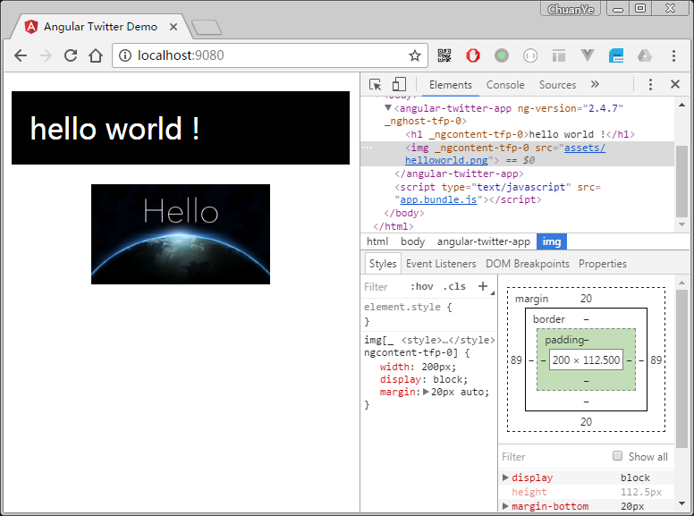
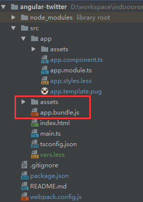
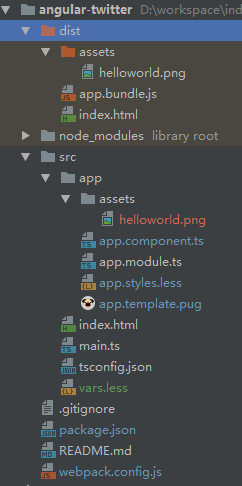

<h1>Angular 2从零开始 - 01.模板引擎和样式预处理器<sub>2017-03-15</sub></h1>

在上篇[Angular 2从零开始 - 00.概述&HelloWorld](./Angular-2E4BB8EE99BB6E5BC80E5A78BE7B3BBE58897---00)中我们已经实现了一个简单的HelloWorld页面，现在我们来继续丰富一下页面和样式，并引入模板引擎[pug](https://pugjs.org)和CSS预处理器[less](http://lesscss.org/)

## 安装相关依赖

- [pug-html-loader](https://github.com/willyelm/pug-html-loader) 编译pug文件至html
- [html-loader](https://github.com/webpack-contrib/html-loader) 处理html中对图片等静态资源的引用
- [less-loader](https://github.com/webpack-contrib/less-loader) 编译less文件至css
- [less](http://lesscss.org/) `less-loader`依赖它
- [css-loader](https://github.com/webpack-contrib/css-loader) 处理css中对图片等静态资源的引用
- [css-to-string-loader](https://github.com/smithad15/css-to-string-loader) 将`css-loader`的输出转换成字符串
- [file-loader](https://github.com/webpack-contrib/file-loader) 处理图片等静态资源

```bash
npm i pug-html-loader html-loader less less-loader css-loader css-to-string-loader file-loader --save-dev
```

## 配置webpack

在`webpack.config.js`中配置静态资源、pug文件、less文件的loader：

```js
module.exports = {

  ...

  module: {
    rules: [
      
      ...
      
      /* 我们把原来处理css和html文件的loader去掉
      {
       test: /\.(css|html|htm)$/,
       use: 'raw-loader'
      }
      */
      {
        test: /\.(png|jpe?g|gif|svg|woff|woff2|ttf|eot|ico)$/,
        use: [
          {
            loader: 'file-loader',
            options: { 
              name: 'assets/[name].[ext]'
            }
          }
        ]
      },
      {
        test: /\.pug$/,
        use: [
          {
            loader: 'html-loader',
            options: {
              minimize: false
            }
          },
          {
            loader: 'pug-html-loader',
            options: {
              pretty: false,
              exports: false,
              doctype: 'html'
            }
          }
        ]
      },
      {
        test: /\.less$/,
        use: [
          'css-to-string-loader',
          'css-loader',
          {
            loader: 'less-loader',
            options: {
              relativeUrls: true
            }
          }
        ]
      }
    ]
  },

  ...
};
```

对于其中每个loader的具体配置这里不再赘述，请参考各自的文档

## 修改组件代码

1. 删除原来的html和css文件
1. 新建 `src/app/app.template.pug` 和 `src/app/app.styles.less`

    pug模板中还是一个简单的hello world标题，只不过增加一张图片：
      
        ```pug
        h1 hello world !
        img(src="./assets/helloworld.png")
        ```
  
    另外我们在 `src` 目录下新建一个 `var.less` 来定义一些less的全局变量，如主背景色，主文字色等，然后在组件的样式中import进来：
      
      ```css
      /* src/var.less */
      @mainBgColor: #000;
      @mainTextColor: #fff;
      ```
      
      ```css
      /* src/app/app.styles.less */
      @import "../vars";
      
      h1 {
        padding: 20px;
        font-weight: normal;
        background: @mainBgColor;
        color: @mainTextColor;
      }
      
      img {
        width: 200px;
        display: block;
        margin: 20px auto;
      }
      ```
    
1. 修改`src/app/app.component.ts`中模板和样式的引用
    
    ```js
    import {Component} from "@angular/core";
    @Component({
      selector: 'angular-twitter-app',
      templateUrl: './app.template.pug', // 引用pug文件
      styleUrls: ['./app.styles.less'] // 引用less文件
    })
    export class AngularTwitterAppComponent {
    
    }
    ```

## 运行

```bash
npm start
```



## 修改打包输出路径

在上一步运行之后，你会发现，由于 `webpack.config.js` 中 `file-loader` 的配置，在 `src/app` 目录下会生成一个 `assets` 目录，另外还有生成的 `app.bundle.js`



这些都是由webpack生成并且不应该被编辑，也不应该被提交到版本控制系统中，所以为了使得我们的文件结构更加清晰以及避免混乱，我们把打包输出目录修改为与 `src` 目录同级的 `dist` 目录，同时将 `src/index.html` 复制到 `dist` 目录中。

新建 `dist` 目录：

```bash
mkdir dist
```

复制 `index.html`：

```bash
cp ./src/index.html ./dist/
```

修改 `webpack.config.js`：

```js
module.exports = {
  
  ...
  
  output: {
    path: './dist', // 修改 src 为 dist
    filename: '[name].bundle.js'
  },
  
  ...
  
}
```

删除 `src/assets` `src/app.bundle.js`：

```bash
rm -rf src/assets src/app.bundle.js
```

修改`package.json`的`scritps`中`static-server`的运行目录：

```json
{
  "scripts": {
    ...
    "server": "static-server ./dist",
    ...
  }
}
```

再次执行 `npm start` 之后：



可能你已经发现，现在改动代码后都需要重新执行`npm start`才能看到效果，这是一个很低效的事情，所以接下来我们将会利用[webpack-dev-server](https://webpack.js.org/configuration/dev-server/#devserver)来实现live-reloading

本文示例源码：<https://github.com/indooorsman/angular-twitter/tree/puglessdist>

___EOF___