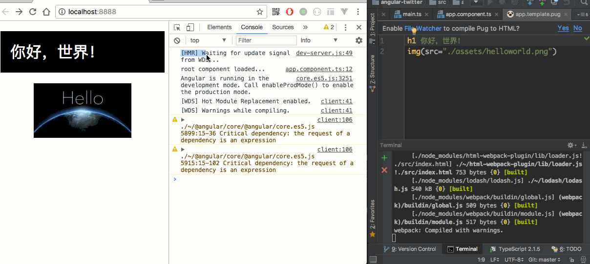
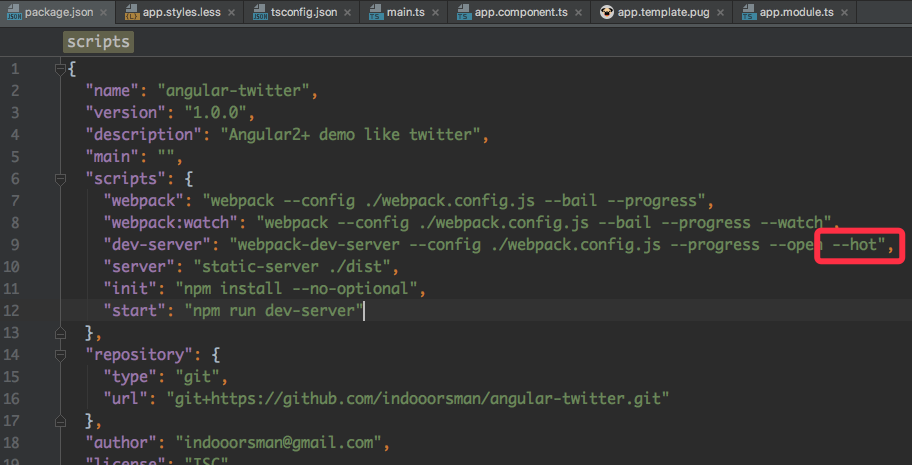

<h1>Angular从零开始 - 03. hot module replacement<sub>2017-06-09</sub></h1>

> 接上篇 [Angular从零开始 - 02. live reloading & webpack dev server](./AngularE4BB8EE99BB6E5BC80E5A78B---02--live-reloading---webpack-dev-server)

## 什么是HMR

webpack官方有非常详细的解释：<https://doc.webpack-china.org/concepts/hot-module-replacement/>

> 模块热替换功能会在应用程序运行过程中替换、添加或删除模块，而无需重新加载页面。这使得你可以在独立模块变更后，无需刷新整个页面，就可以更新这些模块，极大地加速了开发时间。

简单说就是修改代码之后不需要刷新整个页面就能看到效果。

## 启用HMR

先来看一下最终的效果：



从控制台没有先清空可以看出我们在修改了模板文件之后，并不是整个页面reload，而是重新加载了相关的模块，控制台也会输出具体重载了哪些模块

在使用[webpack-dev-server](./AngularE4BB8EE99BB6E5BC80E5A78B---02--live-reloading---webpack-dev-server)的情况下，开启HMR非常的简单：

1. 在启动 `webpack-dev-server` 时添加参数 `--hot`
    
    
1. 在应用入口文件，也就是 `./src/main.ts` 中添加如下代码：
    ```javascript
    if (module && module['hot']) {
      module['hot'].accept();
    }
    ```
1. 如果只有前面2步的话，其实已经可以了，只不过控制台输出的重载的模块信息显示的是模块id，而看不出模块对应的是哪个文件。所以如果你需要关心具体对应的文件的话，在webpack的配置中添加 `NamedModulesPlugin` 即可：   

    
1. 然后启动开发服务就完成啦
  
    ```bash
    npm start
    ```
    
## 本阶段源码
    
<https://github.com/indooorsman/angular-twitter/tree/hmr>
    
> 下一篇教程中我们将会实现[AOT(Ahead-of-time )编译](https://angular.cn/docs/ts/latest/cookbook/aot-compiler.html)

<br/>
    
___EOF___

<br/>    