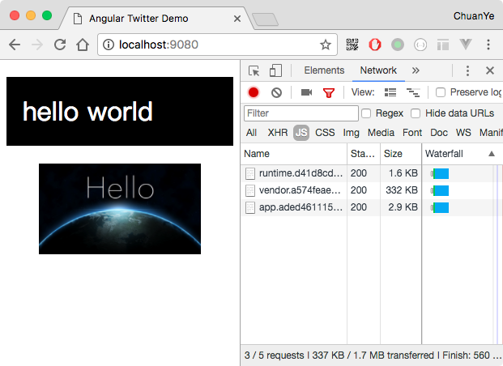

<h1>Angular从零开始 - 04. AoT预编译和生产环境配置<sub>2017-06-27</sub></h1>

> 接上篇 [Angular从零开始 - 03. hot module replacement](./AngularE4BB8EE99BB6E5BC80E5A78B---03--hot-module-replacement)

在我们的项目刚开始的时候就准备好AOT及其他生产环境配置，这样能更早的发现问题并及时进行调整，如果等到整个项目都做完，代码量已经比较大的时候再去做，可能就会面临很多代码都不兼容AOT的可能，那时再做修改就工作量太大了

## 什么是AoT

`AoT`是`Ahead-of-time`的缩写，与`JIT` (`Just-in-time`)相对，在Angular中，AoT即在构建阶段将`html`模板编译成可执行的`js`代码，JIT则是在浏览器运行时进行模板编译

> 事实上只有一个Angular编译器，AOT和JIT之间的差别仅仅在于编译的时机和所用的工具。 使用AOT，编译器仅仅使用一组库在构建期间运行一次；使用JIT，编译器在每个用户的每次运行期间都要用不同的库运行一次。<https://angular.cn/docs/ts/latest/cookbook/aot-compiler.html>

## 实现AoT

在官方的[cookbook](https://angular.cn/docs/ts/latest/cookbook/aot-compiler.html)中，使用的`ngc`来进行`AoT`编译，但是实际项目中`ngc`并不能满足需求，比如需要与`webpack`以及模板引擎和样式预处理器配合时，只用`ngc`的话会很麻烦。。。因此这里我们使用同样是官方出品的`webpack`插件[@ngtools/webpack](https://www.npmjs.com/package/@ngtools/webpack)

1. 安装`@ngtools/webpack`

  ```bash
  npm i @ngtools/webpack --save-dev
  
  # webpack已经发布3.0了，这里我们顺便升级一下webpack及其他依赖
  npm i webpack@latest --save-dev
  npm update
  ```
1. 配置`webpack`

  由于AOT编译过程可能会相对耗时，我们在开发环境和生产环境需要做不同的配置，因此首先我们新建一个AOT的webpack配置
  1. 复制`./webpack.config.js`为`./webpack.aot.config.js`
  1. 修改 `./webpack.aot.config.js`，除了AOT之外，我们也做一些其他针对生产环境的配置，主要包含这几个方面：
      1. 文件名中添加hash，避免缓存。那么为什么不是`a.js?hash=xxx`这种形式呢？这跟CDN缓存有关系，假如将来我们需要把静态文件部署CDN，那么`a.js?hash=xxx`这种形式并不能触发CDN重新请求该文件，即使xxx修改了，用户仍然访问不到最新的a.js。可以参考这篇文章：<http://www.infoq.com/cn/articles/front-end-engineering-and-performance-optimization-part1>
      1. `ts`文件使用`@ngtools/webpack`编译，`plugins`中添加`AotPlugin`
      1. 在`./src/main.ts`中调用Angular的`enableProdMode`方法
      1. 通过`CommonsChunkPlugin`提取公共代码
  
      详情见下列代码中的注释：
      
      ```js
      const path = require('path');
      const HtmlPlugin = require('html-webpack-plugin');
      const AotPlugin = require('@ngtools/webpack').AotPlugin;
      const WebpackChunkHash = require('webpack-chunk-hash');
      const ChunkManifestPlugin = require('chunk-manifest-webpack-plugin');
      const webpack = require('webpack');
      const CommonsChunkPlugin = webpack.optimize.CommonsChunkPlugin;
      const CleanPlugin = require('clean-webpack-plugin');
      const DefinePlugin = webpack.DefinePlugin;
      const dist = path.resolve(__dirname, './dist');
      
      module.exports = {
        entry: {
          'app': './src/main.ts'
        },
      
        // 生成source map方便调试，source-map会生产独立的map文件，可用于生产环境，
        // 参考https://doc.webpack-china.org/configuration/devtool/
        devtool: 'source-map',
      
        output: {
          // 新版的webpack要求path必须是绝对路径
          path: dist,
      
          // 文件名中添加基于chunk内容的hash，避免缓存问题，
          // 参考 https://doc.webpack-china.org/configuration/output/#output-filename
          filename: '[name].[chunkhash].js',
      
          // 配置chunk文件的名称
          // 参考 https://doc.webpack-china.org/configuration/output/#output-chunkfilename
          chunkFilename: 'chunk.[id].[chunkhash].js'
        },
      
        resolve: {
          extensions: ['.js', '.ts'],
          mainFields: ['module', 'browser', 'main']
        },
      
        module: {
          rules: [
            {
              test: /\.ts$/,
              use: [
                // @ngtools/webpack本身会同时编译ts并处理模板，
                // 所以需要替换掉awesome-typescript-loader和angular2-template-loader
                {
                  loader: '@ngtools/webpack'
                }
              ]
            },
            {
              test: /\.(png|jpe?g|gif|svg|woff|woff2|ttf|eot|ico)$/,
              use: [
                {
                  loader: 'file-loader',
                  options: {
                    // 文件名中添加基于文件内容的hash，避免缓存
                    name: 'assets/[name].[hash].[ext]'
                  }
                }
              ]
            },
            {
              test: /\.pug$/,
              use: [
                {
                  loader: 'html-loader',
                  options: {
                    minimize: false
                  }
                },
                {
                  loader: 'pug-html-loader',
                  options: {
                    pretty: false,
                    exports: false,
                    doctype: 'html'
                  }
                }
              ]
            },
            {
              test: /\.less$/,
              use: [
                'css-to-string-loader',
                'css-loader',
                {
                  loader: 'less-loader',
                  options: {
                    relativeUrls: true
                  }
                }
              ]
            }
          ]
        },
      
        plugins: [
          new CleanPlugin([dist]), // 编译前删除dist目录
          new DefinePlugin({
            // 创建一个编译时可用的全局常量`ENV`，让我们可以在代码中区分当前环境，比如在生产环境中调用Angular的`enableProdMode`方法，
            // 参考 ./src/main.ts 第8 - 12行
            // 这里必须用JSON.stringify或者'"prod"'，因为这个插件是直接替换字符串
            // 参考 https://doc.webpack-china.org/plugins/define-plugin/
            'ENV': JSON.stringify('prod')
          }),
          new HtmlPlugin({
            // 指定index.html的模板文件路径
            template: path.resolve(__dirname, './src/index.html')
          }),
          new AotPlugin({
            // 指定tsconfig.json的路径
            tsConfigPath: './src/tsconfig.json',
      
            // 指定入口模块，`#`井号前面是入口模块文件的路径，不包含扩展名，`#`井号后面是入口模块的类名
            entryModule: path.resolve(__dirname, './src/app/app.module#AppModule')
          }),
          new CommonsChunkPlugin({
            name: 'vendor',
            minChunks: module => {
              // 所有node_modules目录下的文件都打包进vendor
              // 参考https://doc.webpack-china.org/plugins/commons-chunk-plugin/
              return (module.resource &&
              (module.resource.indexOf(path.resolve(__dirname, './node_modules')) === 0))
            }
          }),
          new CommonsChunkPlugin({
            // 将runtime和manifest分离出来，避免vendor每次都变化
            // 参考https://doc.webpack-china.org/plugins/commons-chunk-plugin/
            name: 'runtime',
            chunks: ['vendor']
          }),
          new ChunkManifestPlugin({
            // 在html中内联manifest，减少一个请求，同时使得runtime可以被长期缓存
            inlineManifest: true
          }),
          new WebpackChunkHash()
        ],
      
        // AOT一般都是为生产环境准备的，所以去掉devServer
        /*devServer: {
          historyApiFallback: true, // 404将会重定向至index.html
          port: 8888 // 端口号
        }*/
      };
      ```
  1. `package.json`中添加生产环境的构建脚本
  
      ```json
      {
        "scripts": {
          "build:aot": "webpack -p --config ./webpack.aot.config.js --bail --progress"
        }
      }
      ```
      
      `-p`参数会开启js压缩等webpack内置的优化项目，参考<https://doc.webpack-china.org/guides/production/>
      
## 运行编译

```bash
npm run build:aot
```

编译结果：


最后测试一下编译后的文件是不是可以正常执行：

```bash
npm run server
```

 
     
OK! 然后我们就可以部署到生产环境中了，部署过程等我们的demo更完善一些的时候再写

## 本阶段源码

<https://github.com/indooorsman/angular-twitter/tree/prod>

> 现在开发构建环境已经基本完成，接下来就开始我们具体的业务编码了，下一篇就先完成登录页吧 :)

<br/>
    
___EOF___

<br/>